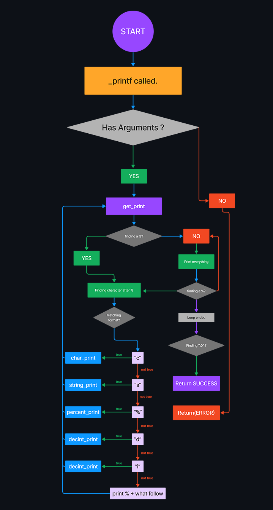
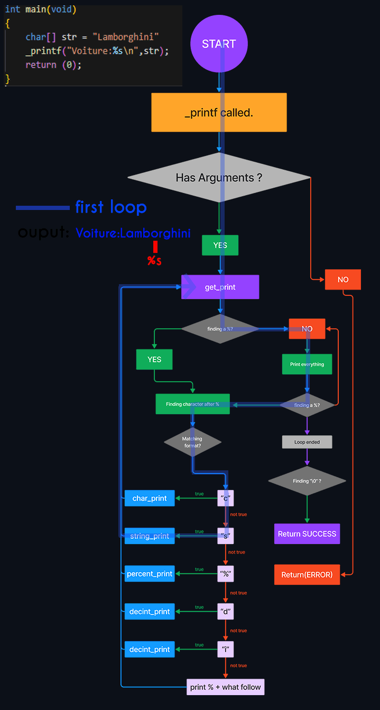

# _printf();
##   Creating our printf function
This repository includes our version of the printf function, the basic and main functions. Here we will apply the knowledge that we have acquired during the learning of the programming language C.
This project is requested by Holberton School.


# Usage and Commands

## Quick Example
```c
_printf("%s has %d Lamborghinis.", "Chris", 2);
```
#### Return :
```
Chris has 2 Lamborghinis.
```

## Commands

| Command     | Description                                                                                                            | Example                  | Output   |
|-------------|------------------------------------------------------------------------------------------------------------------------|--------------------------|----------|
| `%c`        | Print a single  **c**haracter                                                                                          | _printf("%c", 'A')       | A        |
| `%s`        | Print a **s**tring of characters                                                                                       | _printf(%s, "Holberton") | Holberton|
| `%%`        | Print a percent sign (\% also works)                                                                                   | _printf("%%")            | %        |
| `%d`        | Print a decimal (base 10) number`                                                                                      | _printf("%d", -7)        |-7        |
| `%i`        | Print an integer in base 10                                                                                            | _printf("%i", 7)         | 7        |

## Man page
    man ./man_3_printf
## Requirements

>All our  files were compiled on Ubuntu 20.04 LTS.
> Require GCC installed.
> main.h and all the fonctions in it.

## Usage
##### Clone the repository
```c
git clone https://github.com/soOwasTaken/holbertonschool-printf.git
cd holbertonschool-printf
make your own main.c
```
##### usage format :
```c
_printf(const char *format, ...);
```
##### compile using :
```c
gcc -Wall -Werror -Wextra -pedantic -std=gnu89 -Wno-format *.c
```
##### run your program:
    ./a.out
##   Flowchart


##   Exemple of how the flowchart work
<details>
  <summary>Click here to see a explaining GIF.</summary>
  

  
</details>

##   Authors

-   Chris Bikoy

-   Alexandre Mary

-   Ricardo Kollo